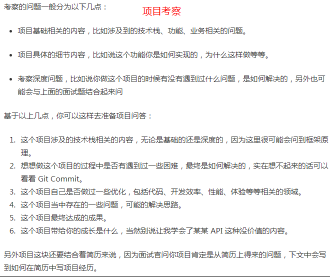

  1. 首页、详情页面图片防抖（bilibili） 百度
  2. 功能模块
    负责开发注册登录、商品查询、购物车、订单支付、退款、工厂直播等10个功能模块；
  3. 将可复用的组件抽取成公共组件，实现自动化导入组件；基于 axios 配置请求拦截器，划分多页面模块 API ，实现 API 文件自动化导入；采用懒加载方式针对商品大数据渲染时间长的问题进行优化；
  4. Webpack
  5. mktail.cn
    DOMContentLoaded: 1.2s Load: 2.3s
    taoba tmall Finish 一直加载 -> banner 加载请求
  6.  店铺可视化装修系统
    > 1. Vue 提供一个内置动态组件 component，可通过 is attribute值来决定当前渲染的组件，vuex 维护和保存一份当前编辑的组件树；
    > 2. 在前台通过获取组件树来渲染当前页面组件和数据
  7. 
    > 1. 优化项目结构，拆分出语言库、组件库、工具库等公共模块；
    > 2. 集成了20 个功能组件可供装修，支持组件增删，拖拽选择功能，支持组件数据上传修改等功能；
    > 3. 负责装修系统的前端性能优化和 Hybird 店铺国际化；
  8. 组件的增删和数据交互，需要实时预览，且保证页面组件和数据的实时同步。
    1.通过 Vuex 维护可视化组件树，预览就是现实vuex 数据，用户编辑数据时保存到后台且通知，维护的组件树
    2.通过本地存储
  9. 首屏优化
    > 1. 首屏代码分块，只加载需要，
    > 2. 路由组件懒加载（resolve =>require）按需加载 ,
    > 3.图片懒加载 
    > 4.减少请求不必要的数据 
    > 5.外部插件按需引入 Mint UI 
    > 6. 服务器开启 gzip 代码压缩, <script>增加defer 或 async来改变脚本执行的时机
  10. 项目
    
    …实现/采集/提高效率/优化/改进…
    精通前端组件库设计，有主导设计过装修系统组件库的经验；Todo: 掘金组件库设计
    https://raw.githubusercontent.com/zhenzhencai/Resume-FontEnd/master/fontend-resume-zhenzhencai.png

